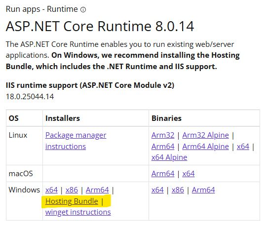
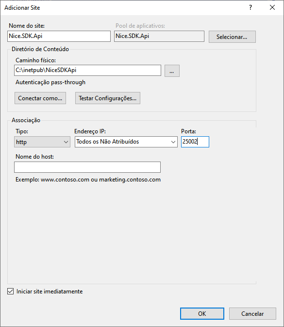
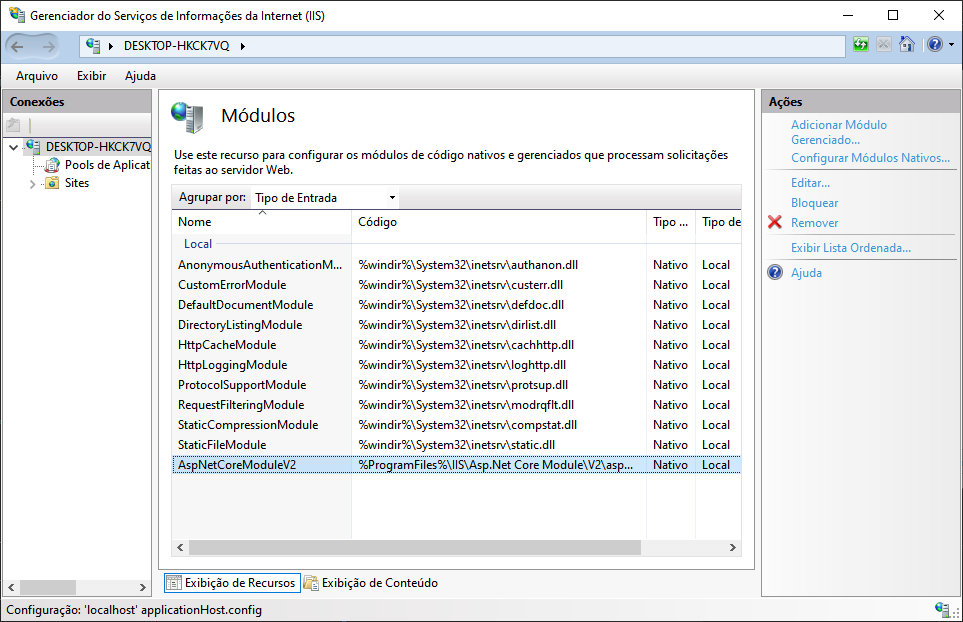
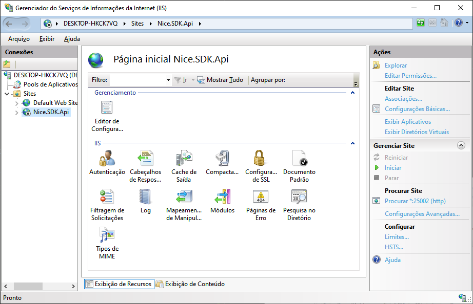
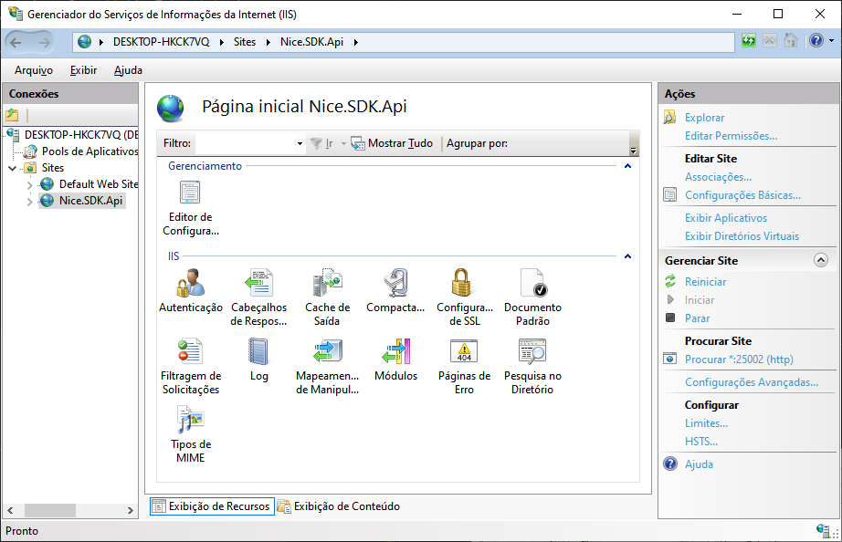

# Sumário

1. [Instalar a Nice.SDK.Api no IIS do Windows](#instalar)
2. [Atualizar a Nice.SDK.Api em instalação já existente](#atualizar)
3. [Chave de ativação](#chaveativacao)


<br>

---
<br>
<br>
<br>


# 📌 [Instalar a Nice.SDK.Api no IIS do Windows](#instalar)

## 1️⃣ Instalar os Pré-requisitos

### 1.1 Instalar o IIS

Se o IIS ainda não estiver instalado, execute no PowerShell como administrador:

```
Enable-WindowsOptionalFeature -Online -FeatureName IIS-WebServer -All
```

Ou instale manualmente via Painel de Controle → Ativar ou desativar recursos do Windows → Marcar "Servidor Web (IIS)".

### 1.2 Instalar o .NET 8 Hosting Bundle
Baixe e instale o .NET 8 Hosting Bundle:

🔗 [Download do Hosting Bundle .NET 8](https://dotnet.microsoft.com/en-us/download/dotnet/8.0)



<br>

---
<br>
<br>
<br>


### 2️⃣ Instalar o MySQL no Windows
A API usa MySQL, portanto é necessário que seja instalado e configurado o banco de dados no servidor.

### 2.1 Baixar e Instalar o MySQL

1. Acesse: 🔗[Download do MySQL](https://dev.mysql.com/downloads/installer/).

2. Baixe o MySQL Installer for Windows.

3. Na instalação, escolha a opção MySQL Server e o MySQL Workbench.

### 2.2 Configurar o MySQL

1. Defina uma senha para o usuário root (anote para configurar na API).

2. Crie um banco de dados para a API (via MySQL Workbench ou prompt de comando):

```
CREATE DATABASE `nice-mg3000-db`;
```

3. Crie um banco de dados para a API (via MySQL Workbench ou prompt de comando):

> Esta etapa é opcional, você pode utilizar o usuário `root` e a respectiva senha ao invés de criar um novo usuário.

```
CREATE USER 'nice_user'@'%' IDENTIFIED BY 'senha_segura';
GRANT ALL PRIVILEGES ON `nice-mg3000-db`.* TO 'nice_user'@'%';
FLUSH PRIVILEGES;
```

4. Se necessário, edite o arquivo my.ini para liberar conexões remotas.


<br>

---
<br>
<br>
<br>


## 3️⃣ Selecionar a plataforma da API

### 3.1 Baixar a versão da API

1. Clique em [Releases](https://github.com/nicebrasil/nice-sdk-delivery/releases).
2. Escolha a plataforma e versão desejada:
   - Any CPU
   - x86
   - x64
3. Baixe o arquivo e descompacte.


<br>

---
<br>
<br>
<br>


## 4️⃣ Configurar a API no IIS

### 4.1 Criar um Diretório para a API

Copie o conteúdo da pasta `publish` da API que foi descompactada no passo anterior para:

```
C:\inetpub\NiceSDKApi
```

### 4.2 Criar um Aplicativo no IIS

1. Abra o Gerenciador do IIS (`inetmgr`).

2. Clique com o botão direito em Sites → Adicionar Site.

3. Preencha os campos:
   - Nome do Site: `Nice.SDK.Api`
   - Caminho Físico: `C:\inetpub\NiceSDKApi`
   - Endereço IP: _"Todos os não atribuídos"_.
   - Porta: Defina a porta (ex: 25002).



4. Clique em OK.

<br>

---
<br>
<br>
<br>


## 5️⃣ Configurar o Módulo do ASP.NET Core

1. No IIS, selecione o site `Nice.SDK.Api`.

2. Em Módulos, verifique se **AspNetCoreModuleV2** está ativado.



<br>

---
<br>
<br>
<br>


## 6️⃣ Configurar o Banco de Dados na API

Edite o appsettings.json da API (`C:\inetpub\NiceSDKApi\appsettings.json`).

> Necessita de privilégio de administrador.

Configure a string de conexão do MySQL:

1. `Database` deve conter o mesmo nome que foi criado na etapa 2.2;
2. `User` deve conter o nome de usuário que foi criado na etapa 2.2 (ou o usuário _root_ caso não tenha criado um usuário específico);
3. `Password` deve conter a senha do usuário escolhido.

```
"ConnectionStrings": {
  "DefaultConnection": "Server=localhost;Database=nice-mg3000-db;User=nice_user;Password=senha_segura;"
}
```

<br>

---
<br>
<br>
<br>


## 7️⃣ Configurar Permissões

1. Vá até `C:\inetpub\NiceSDKApi`.

2. Clique com o botão direito → Propriedades → Segurança.

3. Adicione o usuário IIS_IUSRS e dê permissões Leitura e Execução.

<br>

---
<br>
<br>
<br>


## 8️⃣ Criar o `web.config`
Se o arquivo `web.config` não foi gerado, crie manualmente em `C:\inetpub\NiceSDKApi`:

```
<?xml version="1.0" encoding="utf-8"?>
<configuration>
  <location path="." inheritInChildApplications="false">
    <system.webServer>
      <handlers>
        <add name="aspNetCore" path="*" verb="*" modules="AspNetCoreModuleV2" resourceType="Unspecified" />
      </handlers>
      <aspNetCore processPath="dotnet" arguments=".\Nice.MG3000.Api.dll" stdoutLogEnabled="false" stdoutLogFile=".\logs\stdout" hostingModel="inprocess" />
    </system.webServer>
  </location>
</configuration>
```

<br>

---
<br>
<br>
<br>

## 9️⃣ Reiniciar o IIS e Testar a API

1. No Prompt de Comando, reinicie o IIS:

> Necessita de privilégio de administrador, como alternativa pode reiniciar o computador.

```
iisreset
```

2. Teste a API acessando:

    http://localhost:25002/swagger/


<br>

---
<br>
<br>
<br>

## 🔟 Configurar o Firewall (Se necessário)
Se a API não estiver acessível externamente, libere a porta no Firewall do Windows:

```
New-NetFirewallRule -DisplayName "API Nice SDK" -Direction Inbound -Protocol TCP -LocalPort 25002 -Action Allow
```

<br>

---
<br>
<br>
<br>


## 🔹 Conclusão
Agora sua API Nice.SDK.Api está rodando no IIS com o MySQL configurado! 🚀

<br>

---
<br>
<br>
<br>
<br>

# 🔄 [Atualizar a Nice.SDK.Api em instalação já existente](#atualizar)

## 1️⃣ Parar a execução da API

1. Abra o Gerenciador do IIS (`inetmgr`).

2. Selecione o site `Nice.SDK.Api`.

3. Em `Gerenciar Site`, clique em `Parar`.



<br>

---
<br>
<br>
<br>


## 2️⃣ Selecionar a plataforma da API

### 1.1 Baixar a versão da API atualizada

1. Clique em [Releases](https://github.com/nicebrasil/nice-sdk-delivery/releases).
2. Escolha a plataforma e versão desejada:
   - Any CPU
   - x86
   - x64
3. Baixe o arquivo e descompacte.


<br>

---
<br>
<br>
<br>


## 3️⃣ Atualizar os arquivos da API

### 3.1 Backup do appsettings

Faça um backup do arquivo appsettings.json (`C:\inetpub\NiceSDKApi\appsettings.json`) para outra pasta a sua escolha.


### 3.2 Copiar os arquivos atualizados para a pasta da API

Copie o conteúdo da pasta `publish` da API que foi descompactada na etapa anterior, substituindo os arquivos no destino:

```
C:\inetpub\NiceSDKApi
```

### 3.3 Atualizar a string de conexão

1. Edite o `appsettings.json` de backup.

2. Copie o conteúdo da `DefaultConnection` (que deverá conter o usuário e a senha que foi escolhido durante o processo de instalação inicial).

3. Edite o appsettings.json da pasta da API (`C:\inetpub\NiceSDKApi\appsettings.json`).

4. Cole o conteúdo da memória substituindo o conteúdo da `DefaultConnection`.


```
"ConnectionStrings": {
  "DefaultConnection": "Server=localhost;Database=nice-mg3000-db;User=nice_user;Password=senha_segura;"
}
```

<br>

---
<br>
<br>
<br>
<br>

## 4️⃣ Iniciar a execução da API

1. Abra o Gerenciador do IIS (`inetmgr`).

2. Selecione o site `Nice.SDK.Api`.

3. Em `Gerenciar Site`, clique em `Iniciar`.



<br>

---
<br>
<br>
<br>

## 5️⃣ Testar o acesso a API

2. Teste a API acessando:

    http://localhost:25002/swagger/


<br>

---
<br>
<br>
<br>


# 🗝️ [Chave de ativação](#chaveativacao)

## Como utilizar a chave de ativação

> Para executar os serviços da API é necessário estar de posse da sua chave de ativação.
1. Clique no botão `Authorize`.
2. Preencha a caixa de texto `ApiKey` com o valor da sua chave de ativação.
3. Clique novamente no botão `Authorize` e em seguida `Close`.


> Após inserir a chave de ativação, qualquer acionamento de serviços no Swagger irá enviar a chave no cabeçalho e a API fará a validação da mesma.
> Caso a chave não seja preenchida os métodos não serão executados por falta de autorização.
