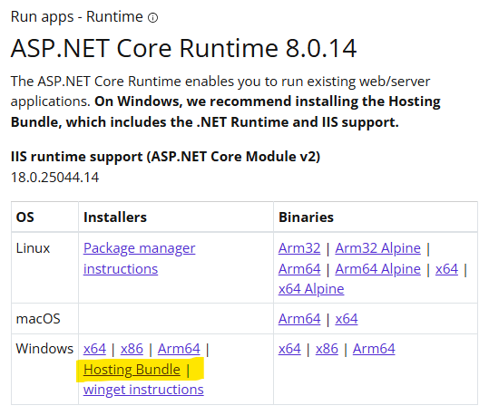
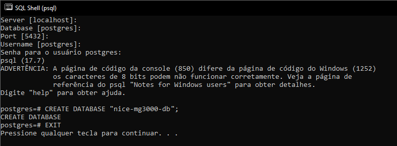
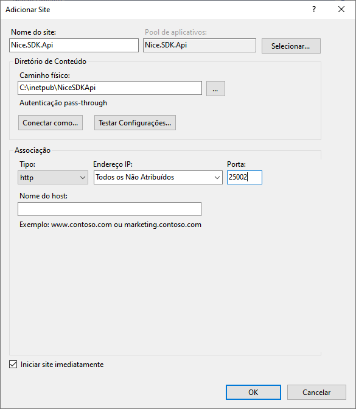
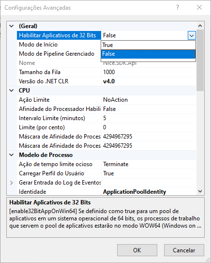
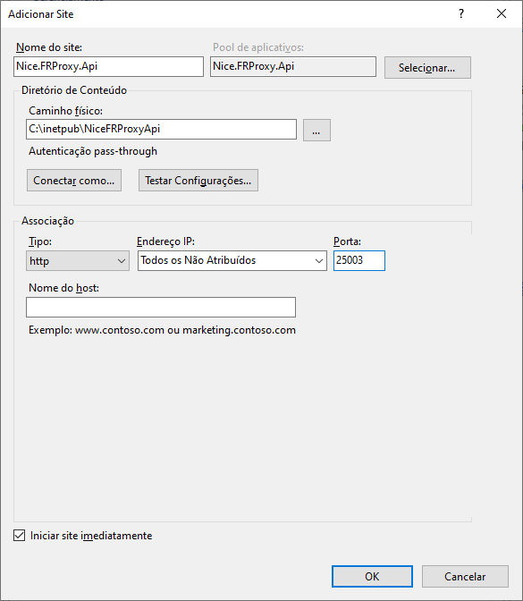
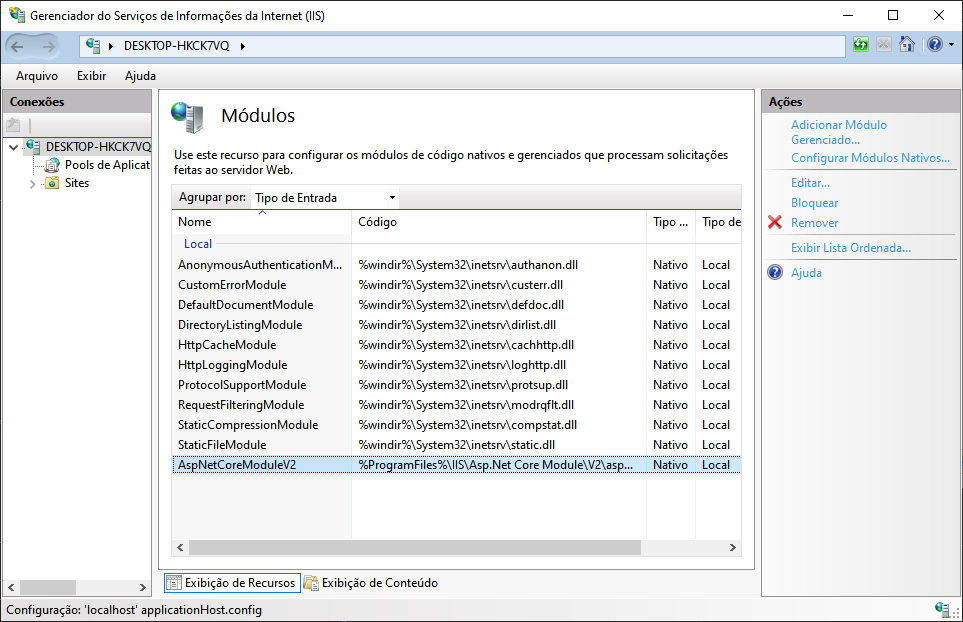
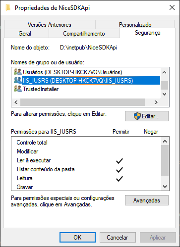
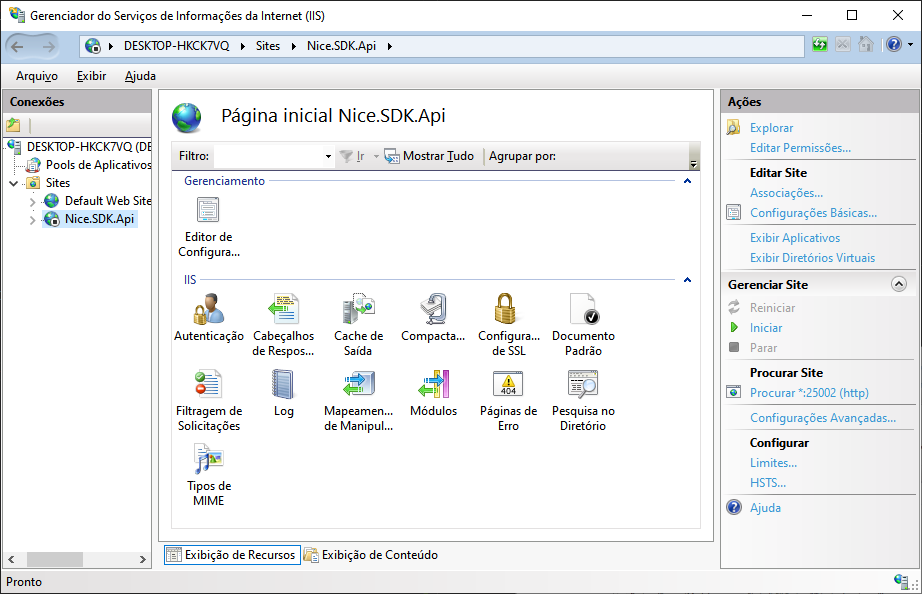
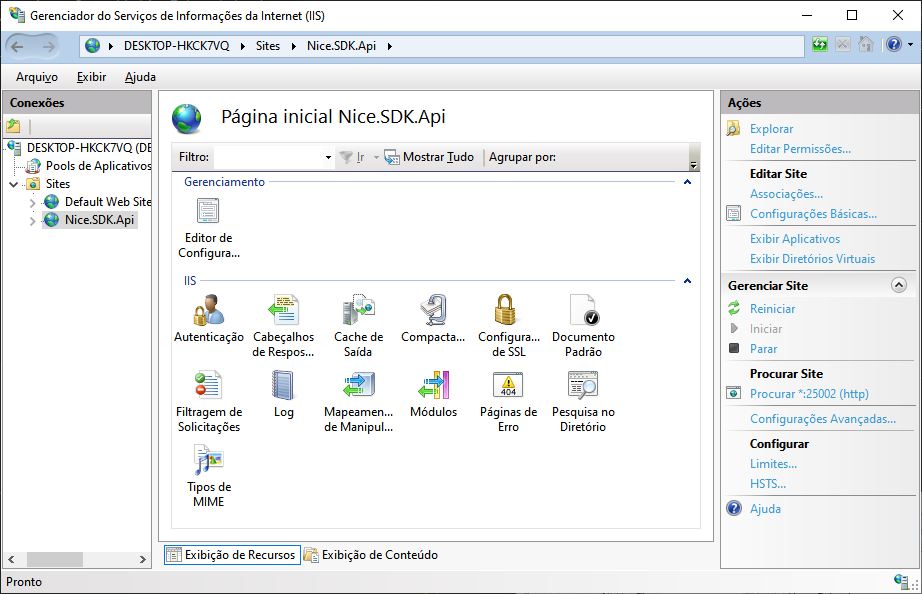
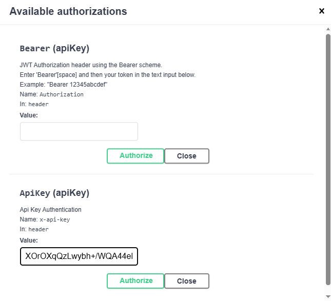

# Sumário

- [Documentação para desenvolvedores](#documentacao-api-sdk)
- [Instalar a Nice.SDK.Api no IIS do Windows](#instalar-a-nice-sdk-api-no-iis-do-windows)
- [Atualizar a Nice.SDK.Api em instalação já existente](#atualizar-a-nice-sdk-api-em-instalacao-ja-existente)
- [Chave de ativação](#chave-de-ativacao)

<br>

---
<br>
<br>
<br>


<a name="documentacao-api-sdk"></a>
# 📑 Documentação para desenvolvedores


A Nice disponibiliza um guia com informações detalhadas sobre como configurar, integrar e utilizar o SDK e a API SDK, com exemplos práticos, orientações passo a passo e boas práticas. Acesse o [guia neste link](https://nice-br.gitbook.io/nice).

<br>

---
<br>
<br>
<br>


<a name="instalar-a-nice-sdk-api-no-iis-do-windows"></a>
# 📌 Instalar a Nice.SDK.Api no IIS do Windows

## 1️⃣ Instalar os Pré-requisitos

### 1.1 Instalar o IIS

Se o IIS ainda não estiver instalado, execute no PowerShell como administrador:

```
Enable-WindowsOptionalFeature -Online -FeatureName IIS-WebServer -All
```

Ou instale manualmente via Painel de Controle → Ativar ou desativar recursos do Windows → Marcar "Servidor Web (IIS)".

### 1.2 Instalar o .NET 8 Hosting Bundle
Baixe e instale o .NET 8 Hosting Bundle:

🔗 [Download .NET 8](https://dotnet.microsoft.com/en-us/download/dotnet/8.0)

🔗 [Download Hosting Bundle .NET 8.0.22](https://dotnet.microsoft.com/en-us/download/dotnet/thank-you/runtime-aspnetcore-8.0.22-windows-hosting-bundle-installer) 

(prefira o hyperlink anterior para selecionar a versão mais recente)



<br>

---
<br>
<br>

### 2️⃣ Instalar o PostgreSQL no Windows
A API usa PostgreSQL, portanto é necessário que seja instalado e configurado o banco de dados no servidor.

### 2.1 Baixar e Instalar o PostgreSQL

1. Acesse: 🔗[Download do PostgreSQL](https://www.postgresql.org/download/).

2. Selecione *Installer for Windows* e faça o download da versão 17.7.

3. Na instalação, escolha a opção **PostgreSQL Server** (obrigatório) e o **pgAdmin 4** (opcional).

4. Durante o processo de instalação defina uma senha para o usuário root (anote para configurar na API).


### 2.2 Configurar o PostgreSQL

1. Abra o *SQL Shell (psql)*.

")

2. Após iniciar a aplicação pressione ENTER para aceitar as opções default e insira a senha que foi criada na etapa de instalação.

3. Crie um banco de dados para a API digitando o comando:

```
CREATE DATABASE "nice-mg3000-db";
```

4. Para encerrar digite:

```
EXIT;
```


<br>

---
<br>
<br>

## 3️⃣ Selecionar a plataforma da API

### 3.1 Baixar a versão da API

1. Clique em [Releases](https://github.com/nicebrasil/nice-sdk-delivery/releases).
2. Escolha a plataforma e versão desejada:
   - `Nice.MG3000.Api_x86.zip` - plataforma x86
   - `Nice.MG3000.Api_x64.zip` - plataforma x64
3. Baixe o arquivo e descompacte.


### 3.2 Baixar a FR Proxy API

1. Clique em [Releases](https://github.com/nicebrasil/nice-sdk-delivery/releases).
2. Selecione o arquivo `Nice.FRProxy.Api.zip`
3. Baixe o arquivo e descompacte.

<br>

---
<br>
<br>

## 4️⃣ Configurar a API no IIS

### 4.1 Criar um Diretório para a Nice.MG3000.Api

Copie o conteúdo da pasta `publish` da Nice.MG3000.Api que foi descompactada no passo anterior para:

```
C:\inetpub\NiceSDKApi
```

### 4.2 Criar um Aplicativo no IIS

1. Abra o Gerenciador do IIS (`inetmgr`).

2. Clique com o botão direito em Sites → Adicionar Site.

3. Preencha os campos:
   - Nome do Site: `Nice.SDK.Api`
   - Caminho Físico: `C:\inetpub\NiceSDKApi`
   - Endereço IP: _"Todos os não atribuídos"_.
   - Porta: Defina a porta (ex: 25002).



4. Clique em OK.

5. Somente se o pacote escolhido foi o `Nice.MG3000.Api_x86` (32-bit)
   - Clique em `Pools de Aplicativos`
   - Selecione `Nice.SDK.Api`
   - Clique em `Configurações Avançadas`
   - Na opção `Habilitar Aplicativos de 32 Bits` altere para `True`
   - Clique `OK` para confirmar



<br>


### 4.3 Criar um Diretório para a Nice.FRProxy.Api

Copie o conteúdo da pasta `publish` da Nice.FRProxy.Api que foi descompactada no passo anterior para:

```
C:\inetpub\NiceFRProxyApi
```

### 4.4 Criar um Aplicativo no IIS

1. Abra o Gerenciador do IIS (`inetmgr`).

2. Clique com o botão direito em Sites → Adicionar Site.

3. Preencha os campos:
   - Nome do Site: `Nice.FRProxy.Api`
   - Caminho Físico: `C:\inetpub\NiceFRProxyApi`
   - Endereço IP: _"Todos os não atribuídos"_.
   - Porta: Defina a porta (ex: 25003).



4. Clique em OK.


### 4.5 Atualizar portas nos appsettings.json

> Necessita de privilégio de administrador.

Caso as portas sugeridas acima não possam ser utilizadas, será necessário atualizar os arquivos de configuração das APIs da seguinte maneira:

1. Nice.FRProxy.Api

    - No arquivo `C:\inetpub\NiceFRProxyApi\appsettings.json`
    - Atualize o valor de `EndpointPort` e `Url` (atualmente com 25003) para a porta que foi associada para a `Nice.FRProxy.Api` no IIS
    - Atualize o valor de `TargetBaseUrl` (atualmente com 25002) para a porta que foi associada para a `Nice.SDK.Api` no IIS

```
{
  "Kestrel": {
    "EndpointPort": 25003,
    "Endpoints": {
      "Http": {
        "Url": "http://0.0.0.0:25003"
      }
    }
  },
...
  "Forwarding": {
    "TargetBaseUrl": "http://127.0.0.1:25002/",
...
```


2. Nice.SDK.Api

    - No arquivo `C:\inetpub\NiceSDKApi\appsettings.json`
    - Atualize o valor de `EndpointPort` (atualmente com 25003) para a porta que foi associada para a `Nice.FRProxy.Api` no IIS
  
```
...
  "FRProxyApi": {
    "EndpointPort": 25003
  },
...
```

---
<br>
<br>

## 5️⃣ Configurar o Módulo do ASP.NET Core

1. No IIS, selecione o site `Nice.SDK.Api`.

2. Em Módulos, verifique se **AspNetCoreModuleV2** está ativado.



3. Ainda no IIS, selecione o site `Nice.FRProxy.Api`.

4. Em Módulos, verifique se **AspNetCoreModuleV2** está ativado.

<br>

---
<br>
<br>

## 6️⃣ Configurar o Banco de Dados na API

Edite o appsettings.json da API (`C:\inetpub\NiceSDKApi\appsettings.json`).

> Necessita de privilégio de administrador.

Configure a string de conexão do PostgreSQL:

1. `Host` deve conter o IP do computador onde foi instalado o PostgreSQL, mantenha `127.0.0.1` para quando o SGBD foi instalado na mesma máquina onde está a API;
2. `Port` deve conter o mesmo valor de porta que foi escolhido no momento da instalação o PostgreSQL, mantenha `5432` se foi utilizado o valor *default*;
3. `Database` deve conter o mesmo nome que foi criado na etapa 2.2;
4. `User` deve conter o nome de usuário padrão do PostgreSQL (postgres) ou um outro usuário que tenha sido criado para uso específico;
5. `Password` deve conter a senha do usuário escolhido.

```
"ConnectionStrings": {
  "DefaultConnection": "Host=127.0.0.1;Port=5432;Database=nice-mg3000-db;Username=postgres;Password=senha_segura;"
}
```

<br>

---
<br>
<br>

## 7️⃣ Configurar Permissões

> Necessita de privilégio de administrador.

1. No **Windows Explorer**, vá até `C:\inetpub\NiceSDKApi`.

2. Clique com o botão direito → Propriedades → Segurança.

3. Adicione o usuário IIS_IUSRS e dê permissões Leitura e Execução.



4. Ainda no **Windows Explorer**, vá até `C:\inetpub\NiceFRProxyApi`.

5. Clique com o botão direito → Propriedades → Segurança.

6. Adicione o usuário IIS_IUSRS e dê permissões Leitura e Execução.

<br>

---
<br>
<br>

## 8️⃣ Criar o `web.config`
Se o arquivo `web.config` não foi gerado, crie manualmente em `C:\inetpub\NiceSDKApi`:

```
<?xml version="1.0" encoding="utf-8"?>
<configuration>
  <location path="." inheritInChildApplications="false">
    <system.webServer>
      <handlers>
        <add name="aspNetCore" path="*" verb="*" modules="AspNetCoreModuleV2" resourceType="Unspecified" />
      </handlers>
      <aspNetCore processPath="dotnet" arguments=".\Nice.MG3000.Api.dll" stdoutLogEnabled="false" stdoutLogFile=".\logs\stdout" hostingModel="inprocess" />
    </system.webServer>
  </location>
</configuration>
```

<br>

---
<br>
<br>

## 9️⃣ Reiniciar o IIS e Testar a API

1. No Prompt de Comando, reinicie o IIS:

> Necessita de privilégio de administrador, como alternativa pode-se reiniciar o computador.

```
iisreset
```

2. Teste as APIs acessando:

    - Nice.SDK.Api: http://localhost:25002/swagger/


    - Nice.FRProxy.Api: http://localhost:25003/heartbeat/

<br>

---
<br>
<br>

## 🔟 Configurar o Firewall (Se necessário)
Se a API não estiver acessível externamente, libere a porta no Firewall do Windows:

```
New-NetFirewallRule -DisplayName "API Nice SDK" -Direction Inbound -Protocol TCP -LocalPort 25002 -Action Allow
```

```
New-NetFirewallRule -DisplayName "API Nice FRProxy" -Direction Inbound -Protocol TCP -LocalPort 25003 -Action Allow
```

<br>

---
<br>
<br>


## 🔹 Conclusão
Agora sua API Nice.SDK.Api está rodando no IIS com o PostgreSQL configurado! 🚀

<br>

---
<br>
<br>
<br>


<a name="atualizar-a-nice-sdk-api-em-instalacao-ja-existente"></a>
# 🔄 Atualizar a Nice.SDK.Api em instalação já existente

## 1️⃣ Parar a execução da API

1. Abra o Gerenciador do IIS (`inetmgr`).

2. Selecione o site `Nice.SDK.Api`.

3. Em `Gerenciar Site`, clique em `Parar`.



<br>

---
<br>
<br>

## 2️⃣ Selecionar a plataforma da API

### 1.1 Baixar a versão da API atualizada

1. Clique em [Releases](https://github.com/nicebrasil/nice-sdk-delivery/releases).
2. Escolha a plataforma e versão desejada:
   - Any CPU
   - x86
   - x64
3. Baixe o arquivo e descompacte.

<br>

---
<br>
<br>


## 3️⃣ Atualizar os arquivos da API

### 3.1 Backup do appsettings

Faça um backup do arquivo appsettings.json (`C:\inetpub\NiceSDKApi\appsettings.json`) para outra pasta a sua escolha.


### 3.2 Copiar os arquivos atualizados para a pasta da API

Copie o conteúdo da pasta `publish` da API que foi descompactada na etapa anterior, substituindo os arquivos no destino:

```
C:\inetpub\NiceSDKApi
```

### 3.3 Atualizar a string de conexão

1. Edite o `appsettings.json` de backup.

2. Copie o conteúdo da `DefaultConnection` (que deverá conter o usuário e a senha que foi escolhido durante o processo de instalação inicial).

3. Edite o appsettings.json da pasta da API (`C:\inetpub\NiceSDKApi\appsettings.json`).

4. Cole o conteúdo da memória substituindo o conteúdo da `DefaultConnection`.


```
"ConnectionStrings": {
  "DefaultConnection": "Host=127.0.0.1;Port=5432;Database=nice-mg3000-db;Username=postgres;Password=senha_segura;"
}
```

<br>

---
<br>
<br>


## 4️⃣ Iniciar a execução da API

1. Abra o Gerenciador do IIS (`inetmgr`).

2. Selecione o site `Nice.SDK.Api`.

3. Em `Gerenciar Site`, clique em `Iniciar`.



<br>

---
<br>
<br>

## 5️⃣ Testar o acesso a API

1. Teste a API acessando:

    http://localhost:25002/swagger/


<br>

---
<br>
<br>


<a name="chave-de-ativacao"></a>
# 🗝️ Chave de ativação

## Como utilizar a chave de ativação

> Para executar os serviços da API é necessário estar de posse da sua chave de ativação.
1. Clique no botão `Authorize`.
2. Preencha a caixa de texto `ApiKey` com o valor da sua chave de ativação.
3. Clique novamente no botão `Authorize` e em seguida `Close`.



> Após inserir a chave de ativação, qualquer acionamento de serviços no Swagger irá enviar a chave no cabeçalho e a API fará a validação da mesma.
> Caso a chave não seja preenchida os métodos não serão executados por falta de autorização.
